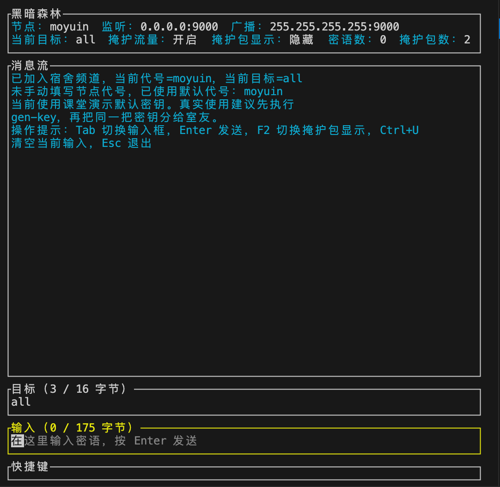

# Dark Forest Broadcast

一个面向“宿舍内网安全通信”作业的网络协议，我愿称之为 DFB，实现有：

- UDP 广播发送
- ChaCha20-Poly1305 认证加密
- 固定长度 256B 数据包
- 周期性 dummy cover traffic
- 监听端按逻辑目标名过滤真实消息
- TUI 聊天页面



---

## 运行方式

release 下载后直接

```bash
./darkforest*
```

### 0. 构建二进制文件

```bash
cargo build --release
```

构建完成后，可执行文件在：

```bash
target/release/darkforest
```

后面的命令如果不想每次都走 `cargo run`，都可以直接改成：

```bash
./target/release/darkforest <子命令> ...
```

### 1. 生成 32 字节密钥

```bash
./target/release/darkforest gen-key
```

会输出一个 64 位十六进制字符串。

### 2. 在接收端启动监听

```bash
./target/release/darkforest listen \
  --name bob \
  --key <上一步输出的key> \
  --bind 0.0.0.0:9000 \
  --broadcast 255.255.255.255:9000
```

默认会后台持续发送 dummy 流量。

如果只想监听、不发 dummy：

```bash
./target/release/darkforest listen \
  --name bob \
  --key <key> \
  --no-dummy
```

如果想看到 dummy 包日志：

```bash
./target/release/darkforest listen \
  --name bob \
  --key <key> \
  --print-dummy
```

### 3. 发送一条真实消息

```bash
./target/release/darkforest send \
  --key <key> \
  --sender alice \
  --target bob \
  --message "今晚八点楼下拿外卖"
```

### 4. 进入 TUI 聊天界面

最省事的启动方式：

```bash
./target/release/darkforest
# 或者是下载后:
./darkforest
```

程序会在启动前询问：

- 节点代号，就是你的名字
- 共享密钥

如果你一时不知道怎么填，可以直接回车用默认值，关于默认值是这样设定的：

- 节点代号默认取当前机器名；如果拿不到机器名，就退回当前用户名，再不行就用 `roommate`
- 共享密钥默认使用一份内置的演示密钥，方便几台机器直接进同一个演示频道

注意：默认密钥只适合演示，不适合真实保密通信。如果是正式使用还是建议先执行 `gen-key` 生成自己的共享密钥。

也可以把参数直接带上：

```bash
./target/release/darkforest tui \
  --name alice \
  --key <key> \
  --target bob
```

TUI 内部操作：

- `Tab`：切换“目标”/“消息”输入框
- `Enter`：发送消息
- `F2`：显示或隐藏 dummy 掩护包
- `Ctrl+U`：清空当前输入框
- `Esc`：退出

---

## 协议思路

所有节点都监听同一个 UDP 端口，并向广播地址发送固定长度密文包。

- 没有真实消息时，节点定时发送 dummy 包
- 有真实消息时，把消息装进同样长度的密文包里广播
- 拿不到共享密钥的人只能看到固定长度 UDP 噪声，即使能看到广播流量，也不容易直接判断哪一包是真聊天”

---

## 包格式

单个数据包总长度固定为 `256` 字节：

- `4B` 魔数：`DFP1`
- `12B` nonce
- `240B` 密文区

密文区解密后是固定 `224B` 载荷，包含：

- 包类型：`dummy` / `message`
- 发送者标签：最多 `16` 字节
- 目标标签：最多 `16` 字节
- 消息长度
- Unix 时间戳
- 序号
- 消息正文：最多 `175` 字节

---

## 当前限制

- 这是课程作业，没有做正式的密钥协商，所以并不算是一个很安全的协议。目前是共享密钥模型，不是完整的匿名路由系统，靠人力发送密钥，依然需要另一种发送方式。（而且你也不会把32字节密钥写到纸上传输吧……）
- 无重放保护窗口协商，只做了进程内最近 nonce 去重
- 消息正文上限是 `175` 字节，用户名和目标名上限是 `16` 字节，没法发送大文件，也没法发小作文（笑
- 广播地址默认是 `255.255.255.255:9000`，其实真实宿舍网段里更推荐改成子网广播地址，比如 `192.168.1.255:9000`
- TUI 目前是单行输入，不支持历史编辑和多行文本，但是我们也就只能发175字节的字，这点也无所谓啦～

## 验证

```bash
cargo check
cargo test
```